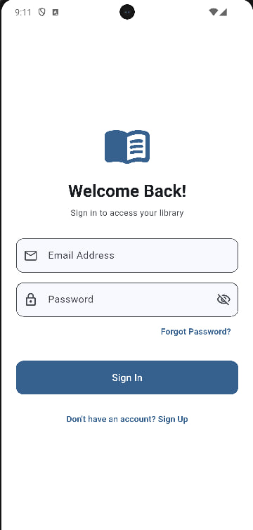
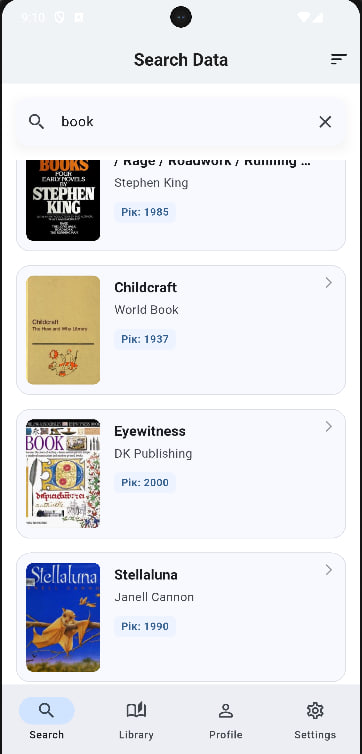
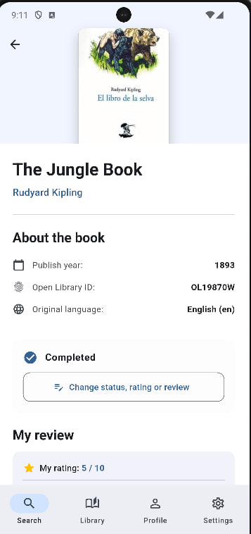
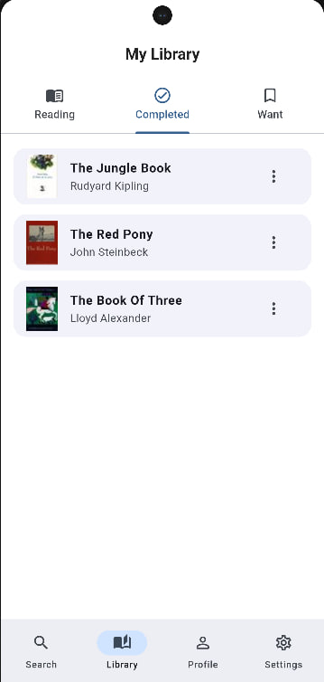
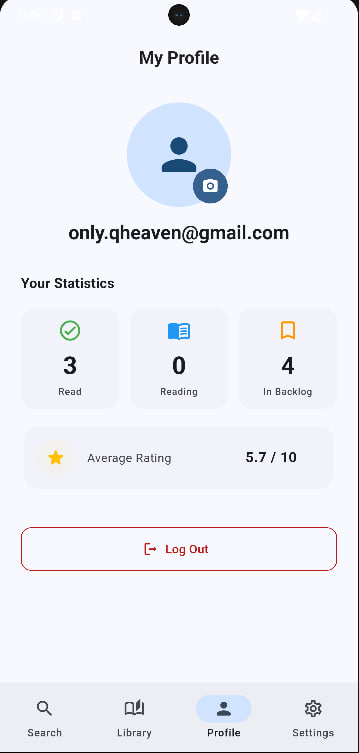
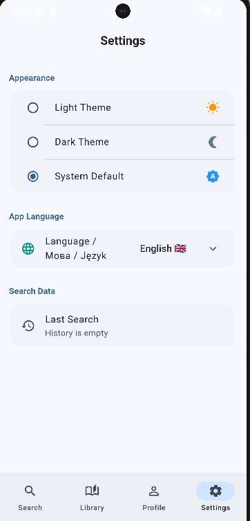

# BookShelf
Built with Flutter 3.24+ · Dart 3.5+ · Material 3 · Riverpod · SharedPreferences · Open Library API.

## Опис
BookShelf — це сучасний мобільний додаток для затятих читачів у стилі преміальних фінтех та контент-платформ. Головна мета додатка — надати користувачу зручний інструмент для миттєвого пошуку книг у світовій базі даних, інтелектуального сортування результатів за роками та авторами, а також персоналізації інтерфейсу під власні потреби з повною підтримкою офлайн-режиму для збереження налаштувань.

### Фічі

Advanced Search — розумний живий пошук книг за назвою, автором чи ключовими словами за допомогою Open Library API.

Dynamic Sorting & Filtering — швидке сортування отриманих книг за роком видання (нові спочатку, старі спочатку) та релевантністю. 

Memory History Sync — додаток автоматично запам'ятовує твій останній успішний пошуковий запит через локальне сховище та відновлює його при наступному запуску додатка.

Settings Hub — персоналізований екран налаштувань користувача з можливістю повного очищення історії пошуку в один тап

Theme Engine — повна підтримка трьох режимів оформлення: світла (Light), темна (Dark) та автоматична системна (System)

Професійна локалізація (l10n) — інтерфейс додатка повністю перекладено на 3 мови (Українська 🇺🇦, English 🇬🇧, Polski 🇵🇱) з використанням офіційного інструменту типізації Flutter. Зміна мови в Dropdown миттєво оновлює весь додаток.

Performance Optimization — відображення списків побудовано виключно на лінивих конструкторах .builder для збереження оперативної пам'яті при рендерингу тисяч книг.

### Технології
**State Management**: Flutter Riverpod (ConsumerWidget, StateProvider, FutureProvider, Provider). Повна відмова від setState для керування бізнес-логікою.

Локальний кеш: shared_preferences для збереження стану мови, обраної теми та історії останнього пошуку.

**UI & Анімації**: Material 3 компоненти, RadioGroup для сучасного вибору тем, ListView.builder для списків, адаптивна палітра кольорів ColorScheme.

**Локалізація**: flutter_localizations, intl, автоматична кодогенерація з .arb файлів шаблонів.


## Архітектура

Проєкт реалізовано за принципами **Clean Architecture** у поєднанні з підходом **Feature First** (модульна структура за фічами). Кожен модуль є ізольованим і ділиться на архітектурні шари відповідно до своєї складності:

1.  **Data** — репозиторії, джерела даних (API / Firebase), моделі та робота з локальним схожищем (SharedPreferences).
2.  **Domain** (для складних фіч, як-от `library`) — чисті інтерфейси, бізнес-сутності та правила. Не залежить від Flutter та зовнішніх пакетів.
3.  **Presentation** — UI-шар: екрани (Screens), компоненти (Widgets) та Riverpod провайдери для керування станом.

```
lib/
├── main.dart                 
├── firebase_options.dart    
├── core/                    
└── features/                
    ├── auth/                
    │   ├── data/
    │   └── presentation/
    ├── home/                
    │   ├── data/
    │   └── presentation/
    ├── library/              
    │   ├── data/
    │   ├── domain/
    │   └── presentation/
    ├── profile/              
    │   ├── data/
    │   └── presentation/
    └── settings/             
        └── presentation/
```

## Скріншоти

| Login | Search | Details |
|---|---|---|
|  |  |  |

| Library | Profile | Settings |
|---|---|---|
|  |  |  |


## Запуск

### 1. Клон і залежності

```bash
git clone <this-repo>
cd bookshelf
flutter pub get
flutter gen-l10n
```

### 2. Firebase

Згенеруйте свій:

```bash
dart pub global activate flutterfire_cli
flutterfire configure
```


### 3. У Firebase Console

1. **Authentication → Sign-in method** → увімкнути **Email/Password**.
2. **Firestore Database** → Create database (будь-який регіон, Spark plan безкоштовний).
3. **Firestore → Rules** → застосувати:

```
rules_version = '2';

service cloud.firestore {
  match /databases/{database}/documents {

    match /users/{userId} {
      allow read, write: if request.auth != null && request.auth.uid == userId;

      match /books/{bookId} {
        allow read, write: if request.auth != null && request.auth.uid == userId;
      }
    }
    
  }
}
```


### Повне очищення кешу та збірки (Якщо виникають конфлікти конфігурацій):

Bash
flutter clean && flutter pub get
Генерація релізної збірки додатка під Android (Універсальний APK):

Bash
flutter build apk --release

# API

Open Library API Docs | https://openlibrary.org/developers/api |
